<p align="center">
  
</p>

# noodle-landing

The landing page for the **Noodle test framework** — 80s synthwave / cyberpunk,
with an animated pixel-art bowl of very hot ramen in the foreground.

> **Noodle framework** — a capability for AI and humans to generate
> deterministic tests using plain English BDD.

Framework itself: [gheeno/noodle](https://github.com/gheeno/noodle).

---

## What's here

```
index.html                        the whole page
assets/css/styles.css             scene, CRT overlay, layout, type
assets/js/main.js                 CRT power-on + pointer parallax (no deps)
assets/img/noodle-bowl-hot.svg    the logo — pixel art, self-animating
assets/img/favicon.svg
assets/fonts/                     self-hosted woff2 (SIL OFL), latin subset
```

Static. No build step, no framework, no third-party requests at runtime.

## Run it

Any static server will do:

```bash
python3 -m http.server 8000
# → http://127.0.0.1:8000
```

Opening `index.html` over `file://` works too, though some browsers block the
self-hosted fonts under that scheme.

## Deploying to GitHub Pages

Settings → Pages → *Deploy from a branch* → pick the branch, folder `/ (root)`.
`.nojekyll` is committed so the `assets/` tree is served verbatim.

---

## The bowl

`assets/img/noodle-bowl-hot.svg` is a redraw of the Noodle README bowl on the
same 12&nbsp;px pixel grid and the same palette — the ramen, the chopsticks and
the pixel-lettered `NOODLE` on the bowl face are unchanged, so it stays the
same mark. What's new is that it's *hot*:

- **Four steam wisps** — pixel columns that rise, widen and fade on staggered
  loops (4.1s–6.2s), so the plume never visibly repeats. They're painted
  *behind* the chopsticks, which keeps the sticks crisp through the vapour.
- **Heat haze** — a warm ellipse over the broth on `mix-blend-mode: screen`,
  breathing on a 2.8s loop.
- **Bubbling hot spots** — amber pixels flickering on the broth surface with
  `steps()` timing, so they pop rather than fade.
- **Neon rim light** — magenta key from the left, cyan fill from the right,
  plus a magenta/violet outer glow, to seat it in the synthwave scene.

Everything is CSS inside the SVG, so it animates as a plain `` with no
JavaScript. `prefers-reduced-motion: reduce` freezes it.

## The scene

The background is one `position: fixed` layer — gradient sky, banded sun,
mountain ridge, skyline, scrolling perspective grid, drifting colour haze —
blurred as a whole with `filter: blur(13px)` and overscanned by 8% so the
blurred edges stay off-screen. Above it sits a *sharp* CRT layer (scanlines +
vignette), and the content sits above that. Nothing in the foreground is
blurred, so the pixel art stays hard-edged against a soft background.

`prefers-reduced-motion: reduce` disables the grid scroll, the haze drift, the
float, the halo pulse and the power-on wipe.

## TENYKS

The footer closes on a **TENYKS** wordmark in outrun chrome. No image — it's
live text, three stacked copies of the same string:

- a heavy dark keyline behind it (`::before`, `-webkit-text-stroke`), so the
  chrome holds against the scene
- the chrome itself: a `background-clip: text` gradient running cool metal down
  to a bright highlight line at the midpoint, then magenta → orange → gold
- scanline bands over the lower half only (`::after`, masked from 54%)

Stroke width and band spacing are in `em`, so they track the font size instead
of clogging the letterforms at mobile sizes. The whole thing is skewed `-8deg`
for the italic speed.

No logos are carried in this repo.

## Licence

Page code: see [`LICENSE`](LICENSE).
Bundled fonts: SIL OFL 1.1, see [`assets/fonts/OFL.txt`](assets/fonts/OFL.txt).
